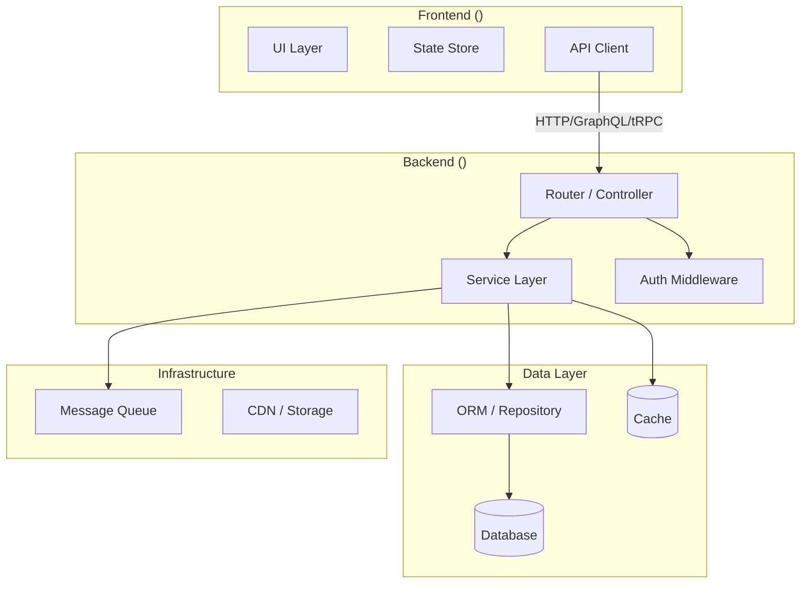
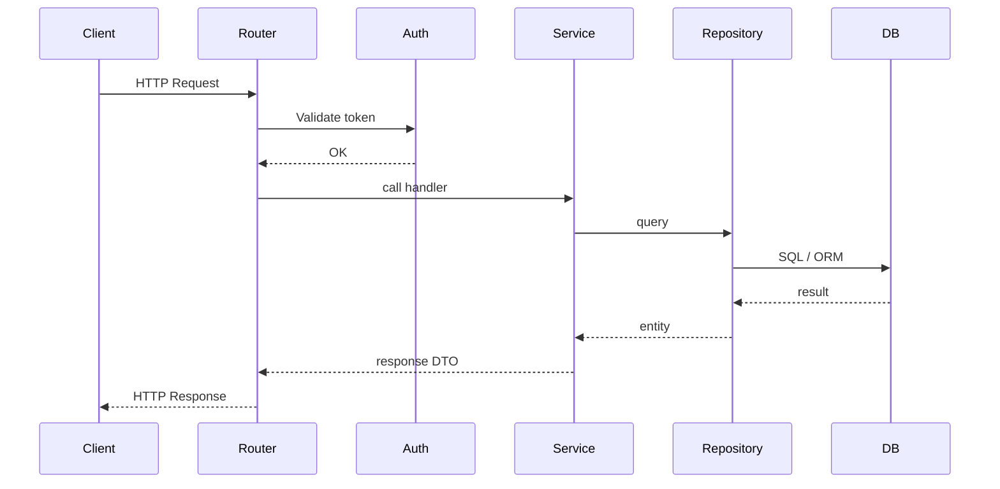

# Architecture Blueprint — Output Template

Use this template to write `docs/architecture.md`. Remove sections that are not applicable. Keep all Mermaid fences intact — fill in diagram content.

---

```markdown
# Architecture Blueprint

> Generated by the `architecture-blueprint` skill.  
> **Repository**: <repo-name>  
> **Analyzed**: <date>  
> **Streams detected**: Frontend | Backend | Data  *(remove inapplicable)*

---

## 1. Overview

<!-- One paragraph: system purpose, scale, architectural style, and which streams are present. -->

---

## 2. Stream Inventory

| Stream | Root Path | Framework / Technology | Sub-agent |
|---|---|---|---|
| Frontend | `<path>` | <e.g., React 18 + Vite> | frontend-analyst |
| Backend | `<path>` | <e.g., NestJS 10> | backend-analyst |
| Data | `<path>` | <e.g., PostgreSQL + Prisma> | data-analyst |

---

## 3. System Architecture



---

## 4. Frontend Analysis

<!-- Paste frontend-analyst report here. Remove this section if no frontend stream. -->

### Component Hierarchy


### Routing Map

| Route Path | Component | Auth Required | Lazy Loaded |
|---|---|---|---|

### State Management

<!-- Describe stores/slices, subscriptions, data lifecycle. -->

### UI-to-API Contracts

| API Call Site | Method | Endpoint / Operation | Response Shape |
|---|---|---|---|

### Styling Architecture

<!-- CSS approach, design system, theming. -->

### Frontend Dependencies

| Package | Role | Notes |
|---|---|---|

---

## 5. Backend Analysis

<!-- Paste backend-analyst report here. Remove this section if no backend stream. -->

### Service Architecture


### API Endpoint Map

| Method | Path / Operation | Handler | Auth | Description |
|---|---|---|---|---|

### Request Lifecycle


### Authentication & Authorization

<!-- Auth mechanism, token lifecycle, authorization rules. -->

### Inter-Service & External Dependencies

| Service / System | Protocol | Direction | Purpose |
|---|---|---|---|

### Error Handling & Observability

<!-- Error propagation, logging approach, tracing/metrics. -->

---

## 6. Data Layer Analysis

<!-- Paste data-analyst report here. Remove this section if no data stream. -->

### Entity-Relationship Diagram
```mermaid
erDiagram
  ...
```

### Database Topology

| Store | Type | Technology | Role |
|---|---|---|---|

### Data Access Surface

| Repository / DAO | Entity | Key Operations |
|---|---|---|

### Data Pipeline Map


### Data Contracts & Event Schemas

| Schema Name | Format | Producer | Consumer | Key Fields |
|---|---|---|---|---|

### Caching Strategy

<!-- What is cached, TTL, invalidation approach. -->

### Migration History

<!-- Key schema milestones in chronological order. -->

---

## 7. Cross-Stream Concerns

### Frontend ↔ Backend Contract
<!-- How the UI consumes the API: REST, GraphQL, tRPC, WebSocket, SSR. -->

### Backend ↔ Data Contract
<!-- How the service layer accesses data: ORM, raw SQL, repositories, events. -->

### Shared Types / Schemas
<!-- Types or contracts shared across stream boundaries (e.g., shared DTO package, OpenAPI spec). -->

### End-to-End Authentication Flow
```mermaid
sequenceDiagram
  ...
```

### Cross-Cutting Infrastructure
<!-- Logging, observability, feature flags, CDN, message queue, secrets management. -->

---

## 8. Architectural Notes

<!-- Bullet list of key patterns, design decisions, coupling concerns, and technical debt observed. -->

- 
- 
- 
```
