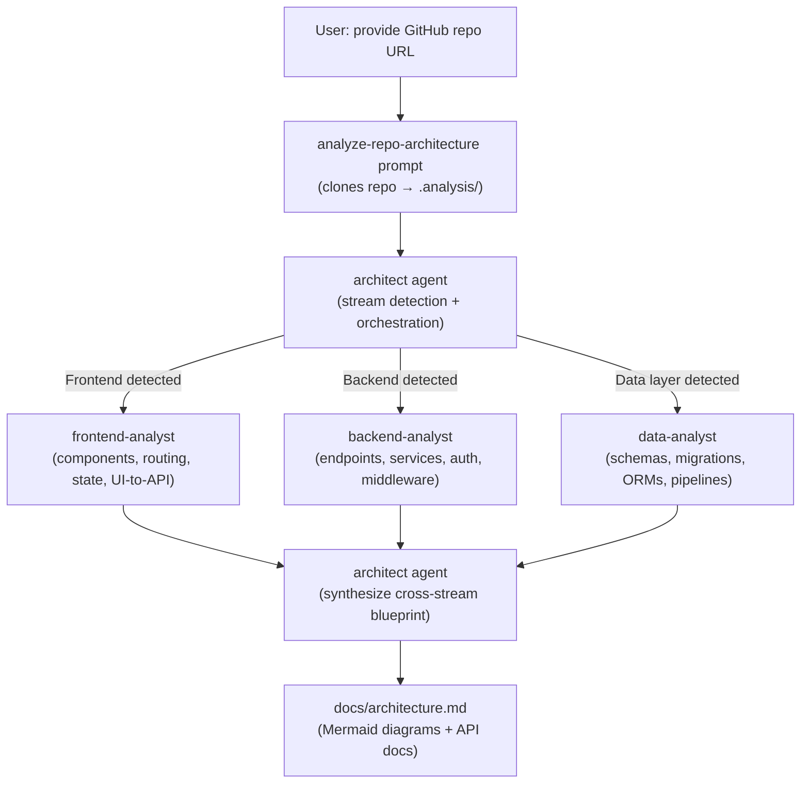

# Architecture Analyzer

A set of GitHub Copilot custom agents and skills that automatically analyze any codebase and produce a comprehensive architectural blueprint — complete with Mermaid diagrams, API surface documentation, component maps, and cross-stream contracts.

---

## What It Does

Point the agent at any public GitHub repository and it will:

- Detect technology streams present (Frontend, Backend, Data)
- Pre-filled prompt available in `analyze-repo-architecture`. More details find under Usage section
- Delegate deep analysis to specialist sub-agents per stream
- Synthesize the results into a unified [`docs/architecture.md`](docs/architecture.md)
- Generate Mermaid component diagrams, sequence diagrams, and ER diagrams
- Document all API endpoints with method, path, auth, and description
- Trace authentication flows, inter-service contracts, and shared schemas

---

## Project Structure

```
.github/
├── agents/
│   ├── architect.agent.md          # Orchestrating architect agent
│   ├── frontend-analyst.agent.md   # Specialist: UI components, routing, state
│   ├── backend-analyst.agent.md    # Specialist: APIs, services, middleware
│   └── data-analyst.agent.md       # Specialist: schemas, migrations, repositories
├── prompts/
│   └── analyze-repo-architecture.prompt.md  # Entry-point prompt
└── skills/
    └── architecture-blueprint/     # Core skill driving the analysis workflow
docs/
└── architecture.md                 # Example output (dotnet/eShop)
```

---

## How It Works



### Stream Detection

| Stream | Delegate Agent | Detection Signals |
|---|---|---|
| Frontend | `frontend-analyst` | `src/`, `client/`, `components/`, `pages/` + React/Vue/Angular/Blazor deps |
| Backend | `backend-analyst` | `server/`, `api/`, `controllers/`, `routes/` + Express/NestJS/FastAPI/ASP.NET deps |
| Data | `data-analyst` | `models/`, `migrations/`, `db/`, `schema/` + Prisma/EF Core/SQLAlchemy/TypeORM deps |

---

## Usage

### 1. Analyze a GitHub Repository

Open Copilot Chat in VS Code, select the `architect` agent mode, and run the built-in prompt:

```
@architect /analyze-repo-architecture https://github.com/owner/repo
```

Or trigger it via the `analyze-repo-architecture` prompt file directly (`.github/prompts/analyze-repo-architecture.prompt.md`). If no URL is provided, it defaults to `https://github.com/dotnet/eShop`.

The agent will:
1. Clone the repo into `.analysis/<repo-name>/`
2. Detect streams and delegate to specialist sub-agents
3. Write the synthesized blueprint to `docs/architecture.md`

### 2. Analyze a Local Codebase

Use the `architect` agent directly with a local path:

```
@architect analyze the codebase at src/
```

---

## Output Format

The generated `docs/architecture.md` follows this structure:

| Section | Contents |
|---|---|
| **Overview** | One-paragraph system summary — purpose, scale, architectural pattern |
| **Stream Inventory** | Table of all detected streams, root paths, and frameworks |
| **System Architecture Diagram** | Top-level Mermaid graph showing all streams and their connections |
| **Frontend Report** | Component hierarchy, routing map, state management, UI-to-API contracts |
| **Backend Report** | Service structure, API endpoint map, request lifecycle sequence diagram |
| **Data Report** | ER diagram, migration history, ORM models, data access patterns |
| **Cross-Stream Concerns** | Frontend↔Backend contract, Backend↔Data contract, auth flow, shared types |
| **Architectural Notes** | Patterns identified, design decisions, potential debt |

---

## Example Output

> **See the full generated output: [docs/architecture.md](docs/architecture.md)**

[docs/architecture.md](docs/architecture.md) contains a full blueprint of [dotnet/eShop](https://github.com/dotnet/eShop) — a cloud-native microservices eCommerce reference app built on .NET 10 and .NET Aspire. It includes:

- Top-level system graph with all 7 backend services, 2 frontends, RabbitMQ event bus, PostgreSQL, and Redis
- Blazor component hierarchy for the WebApp
- Full API endpoint tables for Catalog, Basket, Ordering, and Webhooks APIs
- Create Order request sequence diagram (WebApp → API → MediatR → EF Core → RabbitMQ)

---

## Requirements

- **VS Code** with the **GitHub Copilot** extension (agent mode enabled)
- Git available in your PATH (for the repo-clone prompt workflow)
- Access to a GitHub Copilot plan that supports custom agents

---

## License

[LICENSE](LICENSE)
