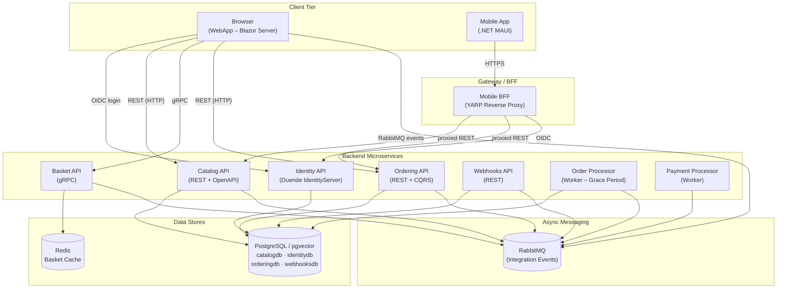
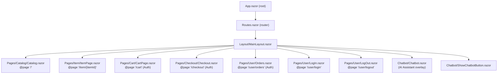
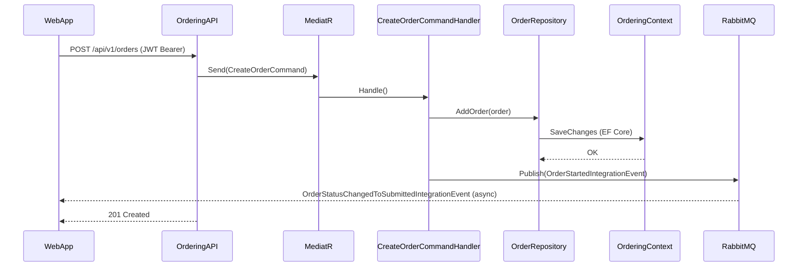
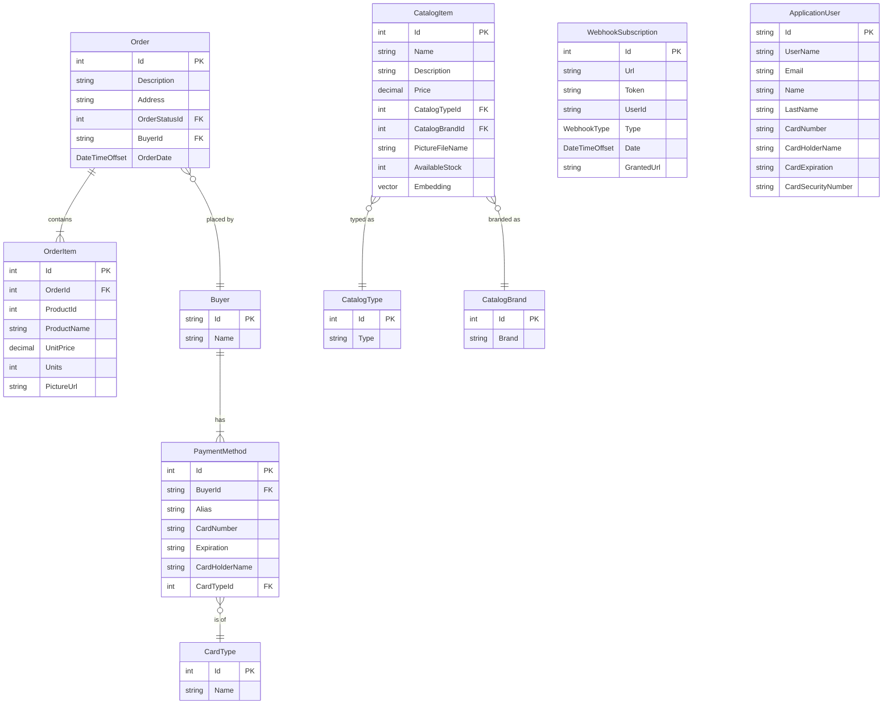
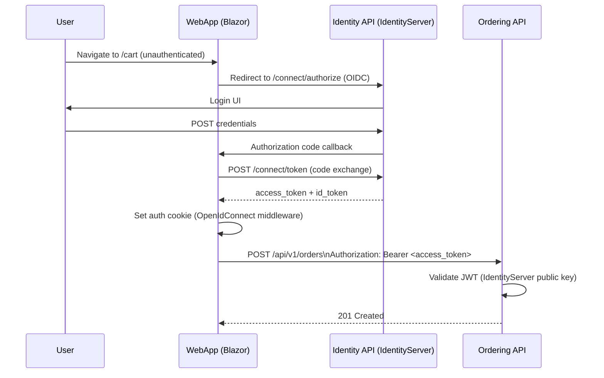

# Architecture Blueprint

> Generated by the `architecture-blueprint` skill via `analyze-repo-architecture` prompt.
> **Repository**: [dotnet/eShop](https://github.com/dotnet/eShop)
> **Analyzed**: 13 March 2026
> **Streams detected**: Frontend · Backend · Data

---

## 1. Overview

eShop is a Microsoft reference application that demonstrates a cloud-native, microservices-based eCommerce platform built on **.NET 10** and orchestrated with **.NET Aspire**. The system comprises seven independently deployable backend services (Catalog, Basket, Ordering, Identity, Webhooks, OrderProcessor, PaymentProcessor) plus two frontends (a Blazor Server web storefront and a .NET MAUI mobile app), connected via both synchronous HTTP/gRPC calls and asynchronous RabbitMQ integration events. The Ordering service applies Clean Architecture and CQRS internally, while other services follow a simpler layered pattern. A Mobile BFF (YARP reverse proxy) gates mobile traffic. All services share a `ServiceDefaults` cross-cutting library for Aspire telemetry, health checks, and service discovery.

---

## 2. Stream Inventory

| Stream | Root Path | Framework / Technology | Sub-agent |
|---|---|---|---|
| Frontend (Web) | `src/WebApp/` | Blazor Server, ASP.NET Core 10, Razor Components | frontend-analyst |
| Frontend (Mobile) | `src/ClientApp/` | .NET MAUI 10 (Android, iOS, macOS, Windows) | frontend-analyst |
| Frontend (Components) | `src/WebAppComponents/` | Shared Blazor component library | frontend-analyst |
| Backend – Catalog | `src/Catalog.API/` | ASP.NET Core Minimal API, EF Core, pgvector | backend-analyst |
| Backend – Basket | `src/Basket.API/` | ASP.NET Core gRPC, StackExchange.Redis | backend-analyst |
| Backend – Ordering | `src/Ordering.API/` + `Ordering.Domain/` + `Ordering.Infrastructure/` | ASP.NET Core Minimal API, Clean Architecture, CQRS, MediatR, EF Core | backend-analyst |
| Backend – Identity | `src/Identity.API/` | Duende IdentityServer 6, ASP.NET Identity, EF Core | backend-analyst |
| Backend – Webhooks | `src/Webhooks.API/` | ASP.NET Core Minimal API, EF Core | backend-analyst |
| Backend – OrderProcessor | `src/OrderProcessor/` | Worker Service, RabbitMQ | backend-analyst |
| Backend – PaymentProcessor | `src/PaymentProcessor/` | Worker Service, RabbitMQ | backend-analyst |
| Backend – Mobile BFF | `src/eShop.AppHost/` (YARP config) | YARP Reverse Proxy | backend-analyst |
| Data | `src/Ordering.Infrastructure/`, `src/Catalog.API/Infrastructure/`, `src/Identity.API/`, `src/Webhooks.API/`, `src/Basket.API/Repositories/` | PostgreSQL (pgvector), Redis, EF Core, Migrations | data-analyst |
| Infra / Orchestration | `src/eShop.AppHost/` | .NET Aspire, Docker | — |

---

## 3. System Architecture Diagram

---

## 4. Frontend Analysis

### 4a. WebApp — Blazor Server (ASP.NET Core 10)

#### Component Hierarchy

#### Routing Map

| Route Path | Component | Auth Required | Lazy / Streaming |
|---|---|---|---|
| `/` | `Catalog.razor` | No | `@attribute [StreamRendering]` |
| `/item/{itemId}` | `ItemPage.razor` | No | — |
| `/cart` | `CartPage.razor` | Yes (`[Authorize]`) | `@attribute [StreamRendering]` |
| `/checkout` | `Checkout.razor` | Yes (`[Authorize]`) | — |
| `/user/orders` | `Orders.razor` | Yes (`[Authorize]`) | — |
| `/user/login` | `LogIn.razor` | No | — |
| `/user/logout` | `LogOut.razor` | No | — |

#### State Management

Blazor Server uses server-side component state (no Redux/Zustand). Key stateful services injected per-circuit:
- `BasketState` — in-memory basket item count, backed by `BasketService` (calls Basket gRPC API)
- `OrderStatus` integration event handlers — subscribe to RabbitMQ events via scoped handlers, push updates to the UI via `EventCallback`
- No global client-side store; state lives in DI-registered scoped services and component fields

#### UI-to-API Contracts

| Service | Protocol | Target Backend | Operation |
|---|---|---|---|
| `CatalogService` | HTTP REST | `catalog-api` | GET /api/catalog/items, GET /api/catalog/items/{id} |
| `BasketService` | gRPC | `basket-api` | GetBasket, UpdateBasket, DeleteBasket |
| `OrderingService` | HTTP REST | `ordering-api` | GET/POST /api/v1/orders, PUT /cancel, PUT /ship |
| `ProductImageUrlProvider` | HTTP (YARP forward) | `catalog-api` | `/product-images/{id}` |
| AI Chatbot | Azure OpenAI / Ollama | External (opt-in) | Chat completions |

#### Styling Architecture

Static files in `wwwroot/`. Per-component `.razor.css` isolation files. No CSS framework detected (custom CSS). Chatbot has its own `Chatbot.razor.css` and client-side `Chatbot.razor.js` for interop.

#### Frontend Dependencies (WebApp)

| Package | Role |
|---|---|
| `Microsoft.AspNetCore.Authentication.OpenIdConnect` | OIDC login flow with Identity API |
| `Grpc.Net.ClientFactory` + `Google.Protobuf` | gRPC client for Basket API |
| `Aspire.Azure.AI.OpenAI` | Optional AI chatbot (Azure OpenAI) |
| `CommunityToolkit.Aspire.OllamaSharp` | Optional AI chatbot (local Ollama) |
| `Microsoft.Extensions.ServiceDiscovery.Yarp` | Service discovery for proxied requests |
| `Asp.Versioning.Http.Client` | API versioning client |

### 4b. ClientApp — .NET MAUI (Mobile)

Multi-target (Android, iOS, macOS, Windows). MVVM pattern: `ViewModels/` ↔ `Views/` ↔ `Services/`. App shell in `AppShell.xaml`. Communicates with backend via the Mobile BFF (YARP). OIDC authentication against Identity API via WebAuthenticator.

---

## 5. Backend Analysis

### Service Architecture

```mermaid
graph TD
  subgraph IdentityAPI["Identity API (Duende IdentityServer)"]
    IdSrv["IdentityServer\n(OIDC Provider)"]
    IdDB[("identitydb\nPostgreSQL")]
    IdSrv --> IdDB
  end

  subgraph CatalogAPI["Catalog API (Minimal API)"]
    CatEndpoints["CatalogApi.cs\n(REST endpoints)"]
    CatCtx["CatalogContext\n(EF Core)"]
    CatEvt["CatalogIntegrationEventService"]
    CatEndpoints --> CatCtx
    CatEndpoints --> CatEvt
  end

  subgraph BasketAPI["Basket API (gRPC)"]
    BasketSvc["BasketService\n(gRPC)"]
    BasketRepo["RedisBasketRepository"]
    BasketSvc --> BasketRepo
  end

  subgraph OrderingAPI["Ordering API (Clean Arch + CQRS)"]
    OrdEndpoints["OrdersApi.cs\n(REST endpoints)"]
    OrdCmds["Commands + Handlers\n(MediatR)"]
    OrdDomain["Domain: Order, Buyer\n(Aggregates + DomainEvents)"]
    OrdRepo["OrderRepository\nBuyerRepository"]
    OrdCtx["OrderingContext\n(EF Core)"]
    OrdEndpoints --> OrdCmds
    OrdCmds --> OrdDomain
    OrdDomain --> OrdRepo
    OrdRepo --> OrdCtx
  end

  subgraph Workers["Background Workers"]
    OrderProc["OrderProcessor\n(Grace Period Manager)"]
    PayProc["PaymentProcessor\n(Payment Simulator)"]
  end

  subgraph WebhooksAPI["Webhooks API (Minimal API)"]
    WHEndpoints["WebHooksApi.cs"]
    WHCtx["WebhooksContext\n(EF Core)"]
    WHEndpoints --> WHCtx
  end
```

### API Endpoint Map

#### Catalog API (`/api/catalog/...`) — versioned (v1/v2)

| Method | Path | Auth | Description |
|---|---|---|---|
| GET | `/items` | No | List all items (paginated); v2 adds semantic search |
| GET | `/items/by` | No | Get items by IDs |
| GET | `/items/{id:int}` | No | Get item by ID |
| GET | `/items/by/{name}` | No | Search items by name (v1) |
| GET | `/items/{id:int}/pic` | No | Get item picture |
| GET | `/items/withsemanticrelevance/{text}` | No | AI semantic search (v1/v2) |
| GET | `/items/type/{typeId}/brand/{brandId?}` | No | Filter by type and brand |
| GET | `/items/type/all/brand/{brandId?}` | No | Filter by brand only |
| GET | `/catalogtypes` | No | List catalog types |
| GET | `/catalogbrands` | No | List catalog brands |
| PUT | `/items` | No | Update item (v1) |
| PUT | `/items/{id:int}` | No | Update item (v2) |
| POST | `/items` | No | Create item |
| DELETE | `/items/{id:int}` | No | Delete item |

#### Basket API — gRPC (proto: `basket.proto`)

| RPC | Auth | Description |
|---|---|---|
| `GetBasket` | Optional (anon returns empty) | Get current user's basket |
| `UpdateBasket` | Required | Replace basket contents |
| `DeleteBasket` | Required | Clear basket |

#### Ordering API (`/api/v1/orders`)

| Method | Path | Auth | Description |
|---|---|---|---|
| GET | `/{orderId:int}` | Required | Get order by ID |
| GET | `/` | Required | Get all orders for current user |
| GET | `/cardtypes` | Required | List payment card types |
| POST | `/draft` | Required | Create order draft from basket |
| POST | `/` | Required | Create order |
| PUT | `/cancel` | Required | Cancel order |
| PUT | `/ship` | Required | Ship order |

#### Webhooks API (`/api/v1/webhooks`)

| Method | Path | Auth | Description |
|---|---|---|---|
| GET | `/` | Required | List webhook subscriptions |
| GET | `/{id:int}` | Required | Get subscription by ID |
| POST | `/` | Required | Create subscription |
| DELETE | `/{id:int}` | Required | Delete subscription |

### Request Lifecycle (Create Order)

### Authentication & Authorization

- **Provider**: Duende IdentityServer hosted in `Identity.API`
- **Protocol**: OpenID Connect / OAuth 2.0 (Authorization Code with PKCE for web; WebAuthenticator for mobile)
- **Token type**: JWT Bearer (access tokens); refresh tokens for long-lived sessions
- **Session lifetime**: Cookie lifetime 2 hours (configured in IdentityServer)
- **Authorization**: All mutating endpoints use `.RequireAuthorization()`. The Basket gRPC service reads identity from `ServerCallContext` user claims
- **Client registration**: All clients (WebApp, WebhooksClient, Mobile) registered in-memory in `Config.cs` with callback URL injection via Aspire environment variables

### Inter-Service & External Dependencies

| Service / System | Protocol | Direction | Purpose |
|---|---|---|---|
| RabbitMQ (`eventbus`) | AMQP (RabbitMQ SDK) | Pub/Sub | Integration events between all services |
| Redis (`redis`) | TCP (StackExchange.Redis) | Basket API → Redis | Basket storage |
| PostgreSQL (`postgres`) | TCP (EF Core / Npgsql) | Multiple services → PG | Persistent relational data |
| Azure OpenAI / Ollama | HTTPS | WebApp → External | AI catalog search + chatbot (opt-in) |
| YARP (`mobile-bff`) | HTTP reverse proxy | Mobile → Services | Mobile gateway / BFF |

### Error Handling & Observability

- All services call `builder.AddServiceDefaults()` from `eShop.ServiceDefaults` which wires: OpenTelemetry traces + metrics, health check endpoints (`/health`, `/alive`), structured logging via `ILogger`
- Ordering uses `IPipelineBehavior` (MediatR) for `LoggingBehavior` and `ValidatorBehavior` (FluentValidation)
- Problem Details middleware (`AddProblemDetails()`) on Catalog, Ordering, Webhooks APIs
- Outbox pattern (`IntegrationEventLogEF`) used in Catalog and Ordering to ensure event publishing is atomic with DB writes

---

## 6. Data Layer Analysis

### Entity-Relationship Diagram

### Database Topology

| Store | Type | Technology | Role |
|---|---|---|---|
| `catalogdb` | Relational + Vector | PostgreSQL 16 + pgvector | Catalog items, types, brands, AI embeddings, outbox |
| `orderingdb` | Relational | PostgreSQL 16 | Orders, buyers, payment methods, outbox |
| `identitydb` | Relational | PostgreSQL 16 | ASP.NET Identity users, IdentityServer config |
| `webhooksdb` | Relational | PostgreSQL 16 | Webhook subscriptions |
| `redis` | Key-Value Cache | Redis | Basket per-user (key: `/basket/{userId}`) |

### Data Access Surface

| Repository / Context | Entity / Store | Key Operations |
|---|---|---|
| `CatalogContext` (EF Core) | CatalogItem, CatalogType, CatalogBrand | CRUD items, vector similarity search via pgvector |
| `OrderRepository` | Order aggregate | Add, GetById (with items + buyer), Unit of Work |
| `BuyerRepository` | Buyer aggregate | Add, FindById, FindByIdentityId |
| `OrderingContext` | Order, Buyer, PaymentMethod, CardType | Persists via EF Core; applies outbox entries |
| `RedisBasketRepository` | CustomerBasket | GetBasket, UpdateBasket, DeleteBasket (key-value JSON) |
| `ApplicationDbContext` | ApplicationUser, IdentityRole | ASP.NET Identity operations |
| `WebhooksContext` | WebhookSubscription | CRUD subscriptions |

### Outbox / Transactional Messaging

Both Catalog and Ordering use the `IntegrationEventLogEF` outbox pattern:
1. Integration event is written to the `IntegrationEventLog` table **within the same EF Core transaction** as the business mutation
2. A background dispatcher reads pending events and publishes them to RabbitMQ
3. On publish success, the log entry is marked as `Published`

This guarantees **at-least-once delivery** with no lost events on service crash.

### Migration History Summary

**orderingdb:**
- `20230925222426_Initial` — Initial schema (Order, OrderItem, Buyer, PaymentMethod, CardType)
- `20231021004633_FixOrderitemseqSchema` — Fix sequence schema for order items
- `20231026091055_Outbox` — Add `IntegrationEventLog` table for outbox pattern

**catalogdb:**
- `20231009153249_Initial` — Initial schema (CatalogItem, CatalogType, CatalogBrand)
- `20231018163051_RemoveHiLoAndIndexCatalogName` — Remove Hi-Lo sequence, add name index
- `20231026091140_Outbox` — Add `IntegrationEventLog` table for outbox pattern

---

## 7. Cross-Stream Concerns

### Frontend ↔ Backend Contract

| Frontend | Transport | Target Service | Notes |
|---|---|---|---|
| Blazor WebApp | HTTP REST | Catalog API (v1/v2) | Typed `HttpClient` via service discovery |
| Blazor WebApp | gRPC-Web (HTTP/2) | Basket API | Generated client from `basket.proto`; JWT passed as bearer |
| Blazor WebApp | HTTP REST | Ordering API (v1) | Bearer token from OIDC cookie |
| .NET MAUI | HTTPS via YARP BFF | Catalog API, Ordering API, Identity API | BFF configured with `ConfigureMobileBffRoutes` |
| Blazor WebApp | RabbitMQ (subscribe) | Ordering API (event source) | Real-time order status updates pushed to UI |

### Backend ↔ Data Contract

| Service | ORM / Client | Database | Pattern |
|---|---|---|---|
| Catalog API | EF Core + Npgsql + pgvector | catalogdb | Active Record-style via `CatalogContext` |
| Basket API | StackExchange.Redis | Redis | Repository pattern (`IBasketRepository`) |
| Ordering API | EF Core + Npgsql | orderingdb | Repository + Unit of Work + Domain Events |
| Identity API | EF Core + ASP.NET Identity | identitydb | Identity framework conventions |
| Webhooks API | EF Core + Npgsql | webhooksdb | Direct `DbContext` usage |

### Shared Types / Schemas

- `eShop.ServiceDefaults` — shared Aspire service registration, telemetry, health checks used by all services
- `EventBus` / `EventBusRabbitMQ` — `IntegrationEvent` base class, `IEventBus` interface, shared across all services
- `IntegrationEventLogEF` — shared outbox library used by Catalog and Ordering
- `basket.proto` — gRPC contract shared between Basket API and WebApp (compiled to C# in both projects)
- Integration event classes (e.g., `OrderStatusChangedToShippedIntegrationEvent`) are **duplicated** by convention across producer and consumer service projects (no shared NuGet package)

### End-to-End Authentication Flow

### Cross-Cutting Infrastructure

| Concern | Implementation |
|---|---|
| Observability | OpenTelemetry (traces + metrics) via `eShop.ServiceDefaults`; Aspire Dashboard |
| Health checks | `/health` + `/alive` endpoints on all services via `MapDefaultEndpoints()` |
| Service discovery | .NET Aspire service discovery + YARP for proxied routes |
| Structured logging | `ILogger<T>` throughout; correlated via OpenTelemetry trace context |
| Message broker | RabbitMQ with persistent container lifetime |
| Secret management | .NET User Secrets (dev), environment variable injection via Aspire |
| AI (opt-in) | Azure OpenAI or Ollama for catalog semantic search + Chatbot |

---

## 8. Architectural Notes

- **Microservices with Clean Architecture on Ordering**: The Ordering bounded context is the most architecturally rich: it separates Domain (`Ordering.Domain`), Application (`Commands`, `Queries`, `Behaviors`, `DomainEventHandlers`), Infrastructure (`Repositories`, `EntityConfigurations`, `Migrations`), and API layers. Other services are simpler CRUD-over-REST.

- **Duplication of integration event contracts**: Integration event types are copy-pasted into each consuming service — a common microservices pattern that avoids shared NuGet coupling. This is intentional but means event schema changes require updating multiple projects manually.

- **gRPC for Basket** (vs REST for others): Basket is the only service using gRPC, likely because it is called inside a server-rendered circuit (Blazor Server → gRPC over HTTP/2 is efficient for server-to-server calls within the datacenter).

- **Outbox pattern** on Catalog and Ordering ensures integration events are not lost if the service crashes after DB commit but before publishing to RabbitMQ. Other services (Webhooks, Identity) do not use the outbox.

- **pgvector on Catalog**: The `CatalogItem` entity stores an `Embedding` (vector) column, enabling AI-powered semantic product search. This requires the `ankane/pgvector` Docker image.

- **Aspire as deployment backbone**: `.NET Aspire` (`eShop.AppHost`) defines the entire service topology declaratively — infrastructure dependencies, environment wiring, health wait conditions, and URL callbacks. This replaces `docker-compose` for local development and integrates with Azure Container Apps for production.

- **No API Gateway** for web traffic: WebApp talks directly to each backend service over service-discovery-resolved names. Only mobile traffic is routed through a YARP BFF (`mobile-bff`).

- **Identity is a cyclic dependency hub**: `Identity.API` receives callback URLs for WebApp, WebhooksClient, and OrderingAPI at startup via environment variables injected by Aspire, creating a soft cyclic reference. This is a known limitation noted in the AppHost code.

- **AI integration is purely opt-in**: Both `useOpenAI` and `useOllama` flags in `AppHost/Program.cs` default to `false`. No AI features run unless explicitly configured.
